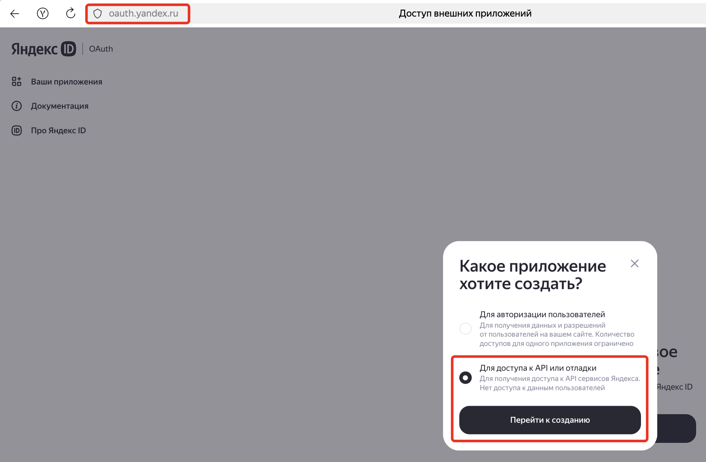
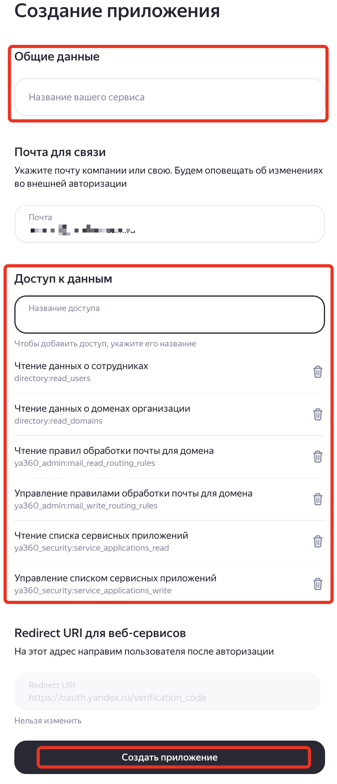
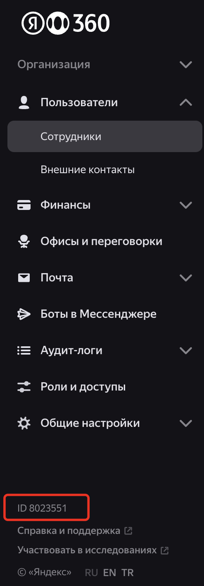
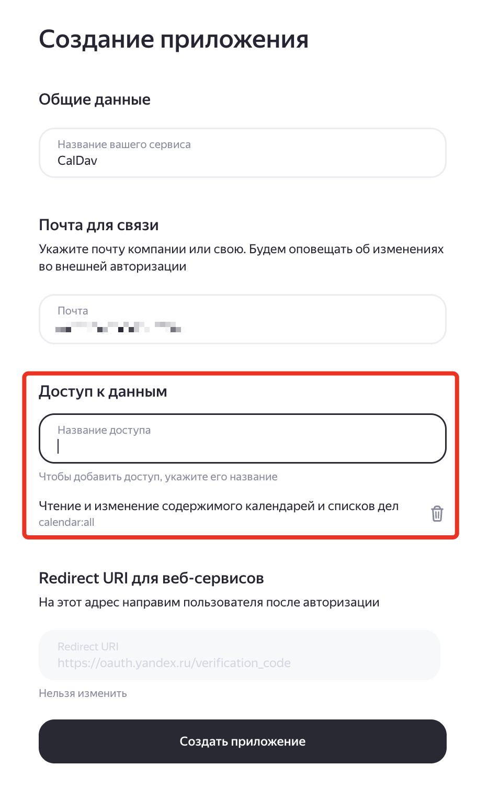

# Экспорт и импорт календарных событий через CalDAV в Яндекс 360

## Содержание

- [Обзор](#обзор)
- [Параметры](#параметры)
- [Режимы работы скрипта](#режимы-работы-скрипта)
- [Форматы файлов](#форматы-файлов)
- [Отчётность](#отчётность)
- [Правила модификации ICS-файлов](#правила-модификации-ics-файлов)
- [Сценарии использования](#сценарии-использования)
- [Удаление событий из Календаря Яндекс 360](#сценарий-7-удаление-событий-из-календаря-яндекс-360)
- [Пошаговая инструкция по импорту событий из Exchange](#пошаговая-инструкция-по-импорту-событий-из-exchange)
- [Пошаговая инструкция по импорту событий из внешнего CalDAV-сервера](#пошаговая-инструкция-по-импорту-событий-из-внешнего-caldav-сервера)
- [Требования к запуску скрипта со стороны Яндекс 360 API](#требования-к-запуску-скрипта-со-стороны-яндекс-360-api)
- [Установка](#установка)
- [Логирование](#логирование)

## Обзор

Скрипт `y360_calendar.py` предназначен для экспорта и импорта календарных событий между Яндекс 360 Календарём и внешними источниками (Microsoft Exchange, произвольный CalDAV-сервер) через протокол CalDAV.

Основная задача — перенести календарные события из исходной системы в Календарь Яндекс 360: выгрузить события в формат ICS, при необходимости преобразовать их с помощью правил модификации и импортировать в календари указанных пользователей организации.

### Ключевые возможности

- **Выгрузка событий из Яндекс 360** — экспорт календарных событий пользователей организации через CalDAV API Яндекс 360 в ICS-файлы
- **Выгрузка событий из внешнего CalDAV-сервера** — экспорт событий из произвольного CalDAV-сервера по учётным данным пользователей
- **Импорт событий в Яндекс 360** — загрузка событий из ICS-файлов в календари пользователей Яндекс 360 с поддержкой нескольких слоёв календаря
- **Правила модификации** — гибкое преобразование ICS-файлов перед импортом: замена полей (SUMMARY, CLASS, ORGANIZER, ATTENDEE), удаление и добавление участников
- **Обработка дубликатов** — настраиваемая политика при совпадении UID событий: пропуск, замена или генерация нового UID
- **Обработка организатора** — настраиваемая политика при несовпадении организатора события с пользователем импорта
- **Многопоточная обработка** — параллельный экспорт и импорт для нескольких пользователей одновременно
- **Парсинг ICS-файлов** — анализ ICS-файлов в каталоге с формированием CSV-отчёта по всем событиям
- **Управление транспортными правилами** — создание и удаление правил обработки почты для блокировки уведомлений об отмене событий при удалении через CalDAV
- **Управление сервисным приложением** — проверка статуса, настройка и удаление сервисного приложения Яндекс 360
- **Режим пробного запуска** — возможность протестировать импорт без фактической записи событий в календарь (DRY_RUN)

## Параметры

Скрипт использует переменные окружения, которые задаются в файле `.env` в каталоге скрипта:

| Параметр | Описание | Обязательный | Пример значения |
|---|---|---|---|
| `OAUTH_TOKEN` | OAuth-токен для аутентификации в API Яндекс 360 | Да | `y0__xxxxx` |
| `ORG_ID` | Идентификатор организации в Яндекс 360 | Да | `1234567` |
| `SERVICE_APP_ID` | ID сервисного приложения Яндекс 360 | Да | `f1e4386f276643` |
| `SERVICE_APP_SECRET` | Секрет сервисного приложения | Да | `333bf50d7a8` |
| `USERS_FILE` | Файл со списком пользователей Яндекс 360 | Нет (по умолчанию `users.csv`) | `users.csv` |
| `DRY_RUN` | Режим пробного запуска (`true`/`false`) | Нет (по умолчанию `false`) | `False` |
| `VERBOSE_LOGGING` | Подробное логирование (`true`/`false`) | Нет (по умолчанию `false`) | `false` |
| `INPUT_DIR` | Каталог с ICS-файлами для импорта | Нет (по умолчанию `input`) | `input` |
| `OUTPUT_DIR` | Каталог для сохранения экспортированных ICS-файлов | Нет (по умолчанию `output`) | `output` |
| `REPORTS_DIR` | Каталог для файлов отчётов | Нет (по умолчанию `reports`) | `reports` |
| `OUTPUT_MAX_MB` | Максимальный размер одного ICS-файла при экспорте в мегабайтах | Нет (по умолчанию `9`) | `9` |
| `THREADS` | Количество потоков для параллельной обработки | Нет (по умолчанию `4`) | `4` |
| `MODIFY_RULES` | Путь к файлу с правилами модификации ICS | Нет (по умолчанию `ical_modify_rules.txt`) | `ical_modify_rules.txt` |
| `RULE_APPLY_REPORT` | Имя файла отчёта о применении правил | Нет (по умолчанию `rule_apply.csv`) | `rule_apply.csv` |
| `ROUTING_RULES_FILE` | Путь к файлу с транспортными правилами обработки почты | Нет (по умолчанию `routing_rules.json`) | `routing_rules.json` |
| `CREATE_CANCEL_RULES_FOR_EVENTS_DELETIONS` | Создавать правило блокировки уведомлений при удалении событий (`true`/`false`) | Нет (по умолчанию `false`) | `true` |
| `EXTERNAL_CALDAV_URL` | URL внешнего CalDAV-сервера | Нет | `https://caldav.server.ru/caldav` |
| `EXTERNAL_CALDAV_USERS_FILE` | Путь к файлу с учётными данными для внешнего CalDAV-сервера | Нет (по умолчанию `external_caldav_users.csv`) | `external_caldav_users.csv` |

### Пример файла `.env`

```
# OAuth токен для доступа к API Yandex 360
OAUTH_TOKEN = y0__xxxxx

# ID организации в Yandex 360
ORG_ID = 1234567

# ID и секрет сервисного приложения для доступа к API Yandex 360
SERVICE_APP_ID = f1e4386f276643
SERVICE_APP_SECRET = 333bf50d7a8

# Путь к файлу с пользователями
USERS_FILE = users.csv

# Режим пробного запуска (true/false)
DRY_RUN = False

# Режим подробного логирования (true/false)
VERBOSE_LOGGING = false

# Путь к файлу с отчётом о применении правил к импортируемым событиям
RULE_APPLY_REPORT = rule_apply.csv

# Путь к файлу с выгрузкой транспортных правил из API Yandex 360
ROUTING_RULES_FILE = routing_rules.json

# Создавать транспортное правило для фильтрации уведомлений удаления событий (true/false)
CREATE_CANCEL_RULES_FOR_EVENTS_DELETIONS = true

# URL внешнего CalDAV-сервера
EXTERNAL_CALDAV_URL = https://caldav.server.ru/caldav

# Путь к файлу с пользователями для подключения к внешнему CalDAV-серверу
EXTERNAL_CALDAV_USERS_FILE = external_caldav_users.csv
```

## Режимы работы скрипта

Скрипт работает в интерактивном режиме через консольное меню:

| Пункт | Описание |
|---|---|
| `1` | Выгрузить события из Календаря Яндекс 360 в ICS-файлы |
| `2` | Выгрузить события из внешнего CalDAV-сервера в ICS-файлы |
| `3` | Импортировать события из ICS-файлов в Календарь Яндекс 360 |
| `4` | Вывести список слоёв календарей пользователей |
| `5` | Парсинг ICS-файлов в каталоге (CSV-отчёт) |
| `6` | Применить правила модификации к файлам ICS |
| `8` | Настроить правила обработки писем для блокировки уведомлений удаления событий |
| `9` | Настройка сервисного приложения |
| `666` | Удаление событий из календаря по умолчанию для выбранных пользователей |
| `0` | Выход |

### Подменю настройки сервисного приложения (пункт 9)

| Пункт | Описание |
|---|---|
| `1` | Проверить статус сервисного приложения |
| `2` | Настроить сервисное приложение |
| `3` | Удаление сервисного приложения из списка организации |
| `4` | Выгрузить данные сервисных приложений в файл |
| `5` | Загрузить параметры сервисных приложений из файла |

### Подменю правил обработки писем (пункт 8)

| Пункт | Описание |
|---|---|
| `1` | Вывести список транспортных правил обработки писем в файл |
| `2` | Загрузить транспортные правила обработки писем из файла |
| `3` | Добавить правило для блокировки уведомлений удаления событий |
| `4` | Удалить правило для блокировки уведомлений удаления событий |

## Форматы файлов

### Входные файлы

#### Файл списка пользователей (`users.csv`)

Текстовый файл, в котором первая строка содержит заголовок `email`, а последующие строки — email-адреса, алиасы или UID пользователей Яндекс 360:

```
email
user01@example.com
user02
11349954305940
```

При указании пользователей в интерактивном режиме также поддерживаются алиасы, UID и фамилия. Ввод `*` выбирает всех пользователей организации, `!` загружает список из файла.

#### Файл учётных данных внешнего CalDAV-сервера (`external_caldav_users.csv`)

CSV-файл с разделителем `;`:

```
alias;login;password
user1;user1@domain.ru;P@ssw0rd!123
user2;user2@domain.ru;P@ssw0rd!123
```

| Поле | Описание |
|---|---|
| `alias` | Алиас пользователя (используется в именах выходных файлов) |
| `login` | Логин для аутентификации на CalDAV-сервере |
| `password` | Пароль для аутентификации |

#### ICS-файлы для импорта

Файлы формата iCalendar (`.ics`) в каталоге `INPUT_DIR`. Имя файла определяет привязку к пользователю и слою календаря:

```
user[~layer~][_YYMMDD_HHMMSS|_YYYYMMDD_HHMMSS][_N].ics
```

| Компонент | Описание | Пример |
|---|---|---|
| `user` | Nickname или email пользователя | `ivanov`, `ivanov@domain.ru` |
| `~layer~` | Имя слоя календаря (опционально); `*layer*` — слой по умолчанию | `~Рабочий~` |
| Метка времени | Дата и время экспорта (опционально) | `_240115_120000` |
| `_N` | Порядковый номер файла (опционально) | `_1`, `_2` |

Примеры:
- `ivanov.ics` — все события пользователя ivanov
- `ivanov~Рабочий~_240115_120000_1.ics` — первый файл слоя «Рабочий» пользователя ivanov
- `ivanov@domain.ru_240115_120000.ics` — файл пользователя по email

>[!WARNING]
> При импорте ICS файлов в Яндекс 360 размер каждого файла не должен превышать 10 Мб

#### Файл правил модификации (`ical_modify_rules.txt`)

Текстовый файл с правилами преобразования ICS-файлов. Подробнее — в разделе [Правила модификации ICS-файлов](#правила-модификации-ics-файлов).

### Выходные файлы

#### ICS-файлы с экспортированными событиями

При экспорте из Яндекс 360 или внешнего CalDAV-сервера для каждого пользователя создаётся один или несколько ICS-файлов в каталоге `OUTPUT_DIR`. Разбиение на несколько файлов происходит при превышении лимита `OUTPUT_MAX_MB`.

## Отчётность

Все отчёты сохраняются в каталоге `REPORTS_DIR` (по умолчанию `reports/`) в формате CSV с разделителем `;`. Имя каждого отчёта содержит метку времени создания в формате `YYMMDD_HHMMSS`.

### Отчёт об импорте (`import_<timestamp>.csv`)

Создаётся при импорте событий (пункт меню `3`). Содержит результат обработки каждого события.

| Поле | Описание |
|---|---|
| `email` | Email пользователя, в чей календарь выполняется импорт |
| `layer` | Имя слоя календаря (`DEFAULT` — календарь по умолчанию) |
| `file` | Путь к ICS-файлу |
| `original_uid` | Исходный UID события из ICS-файла |
| `saved_uid` | UID, под которым событие сохранено (может отличаться от исходного при генерации нового UID) |
| `action` | Выполненное действие (`create`, `replace`) |
| `status` | Результат операции |

Возможные значения `status`:

| Значение | Описание |
|---|---|
| `ok` | Событие успешно импортировано |
| `skip` | Событие пропущено (дубликат UID, отсутствует слой, пользователь не является организатором, отсутствует UID и др.) |
| `error` | Ошибка при импорте |
| `User blocked` | Пользователь заблокирован, импорт невозможен |

### Отчёт об удалении (`delete_<timestamp>.csv`)

Создаётся при удалении событий (пункт меню `666`). Содержит информацию о каждом обработанном событии.

| Поле | Описание |
|---|---|
| `email` | Email пользователя |
| `event-id` | UID события в iCalendar |
| `summary` | Тема события |
| `start_date` | Дата и время начала события |
| `end_date` | Дата и время окончания события |
| `status` | Результат операции |

Возможные значения `status`:

| Значение | Описание |
|---|---|
| `ok` | Событие успешно удалено |
| `error` | Ошибка при удалении |
| `user blocked, skip` | Пользователь заблокирован |
| `no events found, skip` | В календаре не найдено событий для удаления |

### Отчёт о применении правил модификации (`rule_apply_<timestamp>.csv`)

Создаётся при импорте событий с активными правилами модификации (пункт меню `3`), а также при отдельном применении правил к файлам (пункт меню `6`).

| Поле | Описание |
|---|---|
| `file` | Имя ICS-файла, к которому применены правила |
| `rule` | Текстовое представление применённого правила (пустое, если файл не был изменён) |
| `old` | Исходное значение до применения правила |
| `new` | Новое значение после применения правила |

### Отчёт о парсинге ICS-файлов (`events_<timestamp>.csv`)

Создаётся при анализе ICS-файлов (пункт меню `5`). Содержит подробную информацию о каждом событии из всех ICS-файлов в указанном каталоге.

| Поле | Описание |
|---|---|
| `file` | Имя ICS-файла |
| `layer` | Слой календаря (из поля CATEGORIES) |
| `summary` | Тема события |
| `start` | Дата и время начала |
| `end` | Дата и время окончания |
| `timezone` | Часовой пояс события |
| `repeated` | Признак повторяющегося события (`true`/`false`) |
| `rrule` | Правило повторения (RRULE) |
| `sequence` | Номер версии события (SEQUENCE) |
| `organizer` | Организатор события |
| `participants` | Список участников |
| `class` | Классификация события (PUBLIC/PRIVATE/CONFIDENTIAL) |
| `uid` | Уникальный идентификатор события |
| `created` | Дата и время создания события |
| `modified` | Дата и время последнего изменения |
| `url` | URL события |

## Правила модификации ICS-файлов

Перед импортом события могут быть преобразованы с помощью правил из файла `ical_modify_rules.txt` (параметр `MODIFY_RULES`). Правила применяются как при импорте (пункт меню `3`), так и при отдельном запуске (пункт меню `6`).

### Формат правил

```
тег;оператор;значение1;значение2
```

Строки, начинающиеся с `#`, являются комментариями.

### Поддерживаемые теги

| Тег | Описание |
|---|---|
| `class` | Классификация события (PUBLIC/PRIVATE) |
| `summary` | Тема события |
| `attendee` | Участник события |
| `organizer` | Организатор события |
| `*` | Любой тег (для операторов `delete` и `add` применяется к ATTENDEE) |

### Поддерживаемые операторы

| Оператор | Описание |
|---|---|
| `replace` | Замена значения |
| `delete` | Удаление участника по email |
| `add` | Добавление участника |

### Правила замены (`replace`)

```
# Замена CLASS (PUBLIC → PRIVATE):
class;replace;PUBLIC;PRIVATE

# Замена текста в SUMMARY (value1/value2 — регулярные выражения):
summary;replace;Совещание;Встреча
summary;replace;^\[DRAFT\]\s*;
summary;replace;^(\w+)\s*-\s*(.+)$;\2 (\1)

# Замена email в ATTENDEE/ORGANIZER (value1/value2 — шаблоны с подстановочными символами):
attendee;replace;*@old-domain.com;*@new-domain.com
organizer;replace;*@contoso.*;*@360.contoso.ru

# Замена CN-имени в ATTENDEE/ORGANIZER (value1/value2 — регулярные выражения):
attendee;replace;Old Name;New Name
organizer;replace;Old Name;New Name
```

### Правила удаления (`delete`)

```
# Удаление ATTENDEE по email (value1 — шаблон с подстановочными символами):
*;delete;user@domain.com
attendee;delete;*@domain.com
```

### Правила добавления (`add`)

```
# Добавление ATTENDEE (value1/value2 — email и CN-имя в любом порядке, email обязателен):
*;add;user@domain.com;User Name
*;add;User Name;user@domain.com
attendee;add;user@domain.com
```

### Пример файла `ical_modify_rules.txt`

```
tag;operator;value1;value2
summary;replace;Repeated meeting;Повторяющееся событие
*;delete;user@domain.ru
*;add;petr@domain.ru;Петр
*;add;ivan@domain.ru
ORGANIZER;replace;*@contoso.*;*@360.contoso.ru
```

## Сценарии использования

### Сценарий 1: Выгрузка событий из Яндекс 360

**Задача:** Экспортировать календарные события пользователей организации в ICS-файлы.

1. Заполните файл `users.csv` списком пользователей.
2. Запустите скрипт:
   ```bash
   python y360_calendar.py
   ```
3. Выберите пункт меню `1. Выгрузить события из Яндекс 360 Календаря.`
4. Укажите пользователей (из файла `!` или вручную).
5. Укажите диапазон дат для экспорта.
6. ICS-файлы будут сохранены в каталоге `OUTPUT_DIR`.

### Сценарий 2: Выгрузка событий из внешнего CalDAV-сервера

**Задача:** Экспортировать события из произвольного CalDAV-сервера (например, при миграции с другой платформы).

1. Укажите `EXTERNAL_CALDAV_URL` в файле `.env`.
2. Заполните `external_caldav_users.csv` учётными данными пользователей.
3. Запустите скрипт и выберите пункт `2. Выгрузить события из внешнего сервера CalDAV.`
4. Укажите пользователей (из файла `!` или введите `логин:пароль`).
5. Укажите диапазон дат и фильтр (опционально).
6. ICS-файлы будут сохранены в каталоге `OUTPUT_DIR`.

### Сценарий 3: Импорт событий в Яндекс 360

**Задача:** Загрузить события из ICS-файлов (полученных из Exchange или CalDAV) в Календарь Яндекс 360.

1. Разместите ICS-файлы в каталоге `INPUT_DIR` (по умолчанию `input/`).
2. Запустите скрипт и выберите пункт `3. Импортировать все события.`
3. Укажите пользователей для импорта.
4. Выберите политику обработки дубликатов UID:
   - `1` — Пропустить импортируемые события
   - `2` — Заменить существующие события
   - `3` — Сгенерировать новый UID
5. Выберите политику обработки организатора (если организатор не совпадает с пользователем):
   - `1` — Не менять организатора, событие не будет импортировано
   - `2` — Заменить организатора на пользователя импорта
6. Укажите диапазон дат.
7. Скрипт применит правила модификации (если заданы) и импортирует события в календари пользователей.

### Сценарий 4: Применение правил модификации к ICS-файлам

**Задача:** Преобразовать ICS-файлы перед импортом (замена доменов, удаление/добавление участников и т.д.).

1. Опишите правила модификации в файле `ical_modify_rules.txt`.
2. Запустите скрипт и выберите пункт `6. Применить правила модификации к файлам .ics.`
3. Укажите каталог с исходными ICS-файлами и каталог для результатов (по умолчанию `input_after_rules`).
4. Преобразованные файлы будут сохранены в указанный каталог.

### Сценарий 5: Блокировка уведомлений об отмене событий

**Задача:** Предотвратить рассылку уведомлений об отмене при удалении событий из календаря через CalDAV.

1. Запустите скрипт и выберите пункт `8`.
2. Выберите пункт `3` — добавить правило для блокировки уведомлений.
3. Скрипт создаст транспортное правило, которое отбрасывает входящие письма с заголовками `X-Calendar-Action-Source: CALDAV` и `X-Calendar-Mail-Type: event_cancel`.

### Сценарий 6: Парсинг ICS-файлов

**Задача:** Проанализировать содержимое ICS-файлов и получить CSV-отчёт по событиям.

1. Запустите скрипт и выберите пункт `5. Парсинг .ics файлов в каталоге (CSV-отчёт).`
2. Укажите каталог с ICS-файлами.
3. CSV-отчёт `events_<timestamp>.csv` будет сохранён в каталоге `REPORTS_DIR`.

### Сценарий 7: Удаление событий из Календаря Яндекс 360

**Задача:** Удалить календарные события из календаря по умолчанию для одного или нескольких пользователей организации.

> [!WARNING]
> Эта операция необратима. Удалённые события невозможно восстановить.

1. Запустите скрипт и введите `666` в главном меню.
2. Укажите пользователей (из файла `!`, конкретные алиасы или `*` для всех).
3. Укажите диапазон дат для ограничения удаляемых событий (подробнее — в разделе [Ограничение по датам](#ограничение-по-датам-при-удалении)).
4. Подтвердите удаление, введя `yes` или `да`.
5. Скрипт удалит все события из календаря по умолчанию, попадающие в указанный диапазон дат.
6. Отчёт об удалении `delete_<timestamp>.csv` будет сохранён в каталоге `REPORTS_DIR`.

Если параметр `CREATE_CANCEL_RULES_FOR_EVENTS_DELETIONS` установлен в `true`, перед удалением автоматически создаётся транспортное правило для блокировки уведомлений участникам об отмене событий. Если параметр установлен в `false`, всем участникам удаляемых событий будут отправлены уведомления об отмене.

#### Ограничение по датам при удалении

Диапазон дат определяет, какие события будут удалены. Используется формат `<начало> - <конец>` (включительно). Для удаления будут выбраны только те события, дата начала которых попадает в указанный диапазон.

| Ввод | Результат |
|---|---|
| `*` или Enter | Удаление всех событий (без ограничения по датам) |
| `01.01.2024 - 31.12.2024` | Удаление событий с 1 января по 31 декабря 2024 года |
| `* - 31.12.2024` | Удаление всех событий до 31 декабря 2024 года включительно |
| `01.01.2024 - *` | Удаление всех событий начиная с 1 января 2024 года |
| `01.01.24 - 31.12.24` | Допускается сокращённый формат года (2 цифры) |

> [!TIP]
> Рекомендуется сначала выполнить экспорт событий (пункт меню `1`) для нужных пользователей и проанализировать их, прежде чем выполнять удаление.

Формат отчёта об удалении описан в разделе [Отчётность](#отчёт-об-удалении-delete_timestampcsv).

## Пошаговая инструкция по импорту событий из Exchange

### Предпосылки

У вас есть ICS-файлы с событиями, экспортированные из Exchange с помощью компонента [export_ical_by_ews](../export_ical_by_ews/). Подробная инструкция по экспорту — в [README.md](../export_ical_by_ews/README.md) компонента экспорта.

### Шаг 1. Настройка окружения

1. Установите зависимости:
   ```bash
   pip install -r requirements.txt
   ```
2. Создайте файл `.env` в каталоге скрипта и заполните обязательные параметры (`OAUTH_TOKEN`, `ORG_ID`, `SERVICE_APP_ID`, `SERVICE_APP_SECRET`).
3. Заполните файл `users.csv` списком пользователей для импорта.

### Шаг 2. Настройка сервисного приложения

1. Запустите скрипт:
   ```bash
   python y360_calendar.py
   ```
2. Выберите пункт `9. Настройка сервисного приложения.`
3. Выберите пункт `2. Настроить сервисное приложение.`
4. Убедитесь, что статус сервисного приложения — активен (пункт `1`).

### Шаг 3. Подготовка ICS-файлов

1. Скопируйте ICS-файлы из каталога экспорта в каталог `INPUT_DIR` (по умолчанию `input/`):
   ```bash
   mkdir -p input
   cp ../export_ical_by_ews/Publish/output/*.ics input/
   ```
2. Убедитесь, что имена файлов содержат алиасы или email-адреса пользователей (формат: `user@domain.ru_1.ics`).

### Шаг 4. Настройка правил модификации (опционально)

Если необходимо преобразовать события перед импортом (например, заменить домены в адресах организаторов и участников):

1. Отредактируйте `ical_modify_rules.txt`, добавив нужные правила.
2. При необходимости предварительно проверьте результат, применив правила к файлам через пункт `6` и проанализировав результат.

### Шаг 5. Импорт событий

1. Запустите скрипт и выберите пункт `3. Импортировать все события.`
2. Укажите пользователей (введите `!` для загрузки из `users.csv`).
3. Выберите политику обработки дубликатов и политику обработки организатора.
4. Укажите диапазон дат (или `*` / Enter для всех дат).
5. Дождитесь завершения импорта.
6. Отчёт об импорте будет сохранён в каталоге `REPORTS_DIR`.

### Шаг 6. Блокировка уведомлений (рекомендуется)

Если в дальнейшем планируется удаление событий из календаря, рекомендуется заблокировать рассылку уведомлений:

1. Выберите пункт `8` в главном меню.
2. Выберите пункт `3` — добавить правило блокировки уведомлений.

## Пошаговая инструкция по импорту событий из внешнего CalDAV-сервера

### Шаг 1. Настройка окружения

1. Установите зависимости:
   ```bash
   pip install -r requirements.txt
   ```
2. Создайте файл `.env` и заполните обязательные параметры, а также укажите `EXTERNAL_CALDAV_URL`.
3. Заполните файл `external_caldav_users.csv` учётными данными пользователей внешнего CalDAV-сервера.

### Шаг 2. Экспорт событий из внешнего CalDAV-сервера

1. Запустите скрипт:
   ```bash
   python y360_calendar.py
   ```
2. Выберите пункт `2. Выгрузить события из внешнего сервера CalDAV.`
3. Введите `!` для загрузки пользователей из файла `external_caldav_users.csv`.
4. Укажите диапазон дат и фильтр (при необходимости).
5. ICS-файлы будут сохранены в каталоге `OUTPUT_DIR`.

### Шаг 3. Подготовка к импорту

1. Скопируйте экспортированные ICS-файлы в каталог `INPUT_DIR`:
   ```bash
   mkdir -p input
   cp output/*.ics input/
   ```
2. При необходимости настройте правила модификации в `ical_modify_rules.txt`.

### Шаг 4. Импорт событий

Следуйте шагам 5 и 6 из инструкции [импорта из Exchange](#шаг-5-импорт-событий).

## Требования к запуску скрипта со стороны Яндекс 360 API

Для работы скрипта необходимо:
1. Получить OAuth-токен для доступа к API Яндекс 360.
2. Получить ID организации.
3. Создать и настроить сервисное приложение.

### Получение OAuth-токена

1. Для работы приложения необходимо сгенериовать OAuth токен для аутентификации в API Яндекс 360. Токен должен содержать необходимые права для выполения операций управления ресурсами в организации Яндекс 360. Документация - [Создание приложения](https://yandex.ru/dev/id/doc/ru/register-client). 

Последовательность шагов для создания токена:
    * заходим на https://oauth.yandex.ru/client/new/. Аутентифицируемся от имени администратора организации Яндекс 360. Нажимаем на кнопку `Создать приложение` и затем на `Приложение для API или отладки`.

    

    * Заполняем поля в форме создания приложения:
        - Поле "Название вашего сервиса" - произвольное название.
        - Включаем галочку "Веб сервисы"
        - В поле `Redirect URL` вводим `https://oauth.yandex.ru/verification_code`
        - В разделе "Почта для связи" указываем свой email.               
        
    * Добавляем разрешения для токена. Для этого в разделе "Доступ к данным" ищем и добавляем следующие разрешения:

    | Имя разрешения | Что можно делать |
    |----------------|----------|
   | `directory:read_users` | Чтение информации о пользователях |
   | `directory:read_domains` | Чтение информации о доменах |
   | `ya360_admin:mail_read_routing_rules` | Чтение транспортных правил обработки почты |
   | `ya360_admin:mail_write_routing_rules` | Управление транспортными правилами обработки почты |
   | (опционально) `ya360_security:service_applications_read` | чтение  сервисных приложений (для настройки сервисного приложения) |
   | (опционально) `ya360_security:service_applications_write` | запись  сервисных приложений (для настройки сервисного приложения) |
        
    
        
    * нажимаем на кнопку "Создать приложение".
    * Свойства созданного приложения отображаются в новом окне "Мои приложения". Ищем раздел с идентификатором созданного приложения и копируем строку из поля "ClientID":
      
        
        
    * В текстовом редакторе созадем строку вида `https://oauth.yandex.ru/authorize?response_type=token&client_id=<идентификатор приложения>` и вставляем в ней вместо `<идентификатор приложения>` скопированное значение ClientID из предыдущего пункта. 
    Вставляем получившуюся ссылку в браузер и нажимаем "Enter".
    
> [!WARNING]  
> Копируем токен и сохраняем в надёжном месте.

2. Получить ID организации в Яндекс 360. Для этого необходимо зайти в [консоль администрирования](admin.yandex.ru) и в левом нижнем углу интерфейса будет необходимый номер.
   
   
        
3. Записываем полученные на предыдущем шаге OAuth токен и Org ID в соответствующие переменные в файле файле `.env` в том же каталоге, что и сами скрипты. Эта информация нужна для правильной аутентификации скриптов в API Яндекс 360.

### Создание сервисного приложения
Для работы скрипта также необходимо указать параметры сервисного приложения. Для настройки сервисного приложения необходимо наличие в правах основного токена прав:

 - `ya360_security:service_applications_read`
 - `ya360_security:service_applications_write`
 
Для этого необходимо создать ещё одно OAuth приложение, шаги по созданию аналогичны шагам создания основного приложения. Но при указании доступных разрешений нужно указать:

 - `calendar:all`

 

После сохранения приложения нужно скопировать его Application ID и APPLICATION Secret, которые необходимо записать в соответствующие параметры в конфигурационном файле (`SERVICE_APP_ID`, `SERVICE_APP_SECRET`).

> [!WARNING]  
> Для корректной настройки сервисного приложения токен основного приложения необходимо выписывать от имени учётки-владельца организации (в домене `@yandex.ru`).

При первом запуске скрипта перейдите в пункт `9. Настройка сервисного приложения.` и выберите `2. Настроить сервисное приложение.` Это корректно настроит сервисное приложение для работы скрипта.

## Установка

### Системные требования

- **Python**: версия 3.9 или выше
- **Операционная система**: Linux, macOS, Windows
- **Сеть**: доступ к `api360.yandex.net`, `oauth.yandex.ru`, `caldav.yandex.ru`

### Установка зависимостей

```bash
pip install -r requirements.txt
```

Зависимости (`requirements.txt`):
- `python-dotenv` — загрузка переменных окружения из файла `.env`
- `requests` — HTTP-клиент для работы с API

## Логирование

- **Консоль**: сообщения уровня INFO с временными метками (формат: `YYYY-MM-DD HH:MM:SS.mmm INFO: Сообщение`)
- **Файл**: сообщения уровня DEBUG записываются в `y360_calendar.log`, ротация при достижении 10 МБ (хранится 5 резервных копий)
